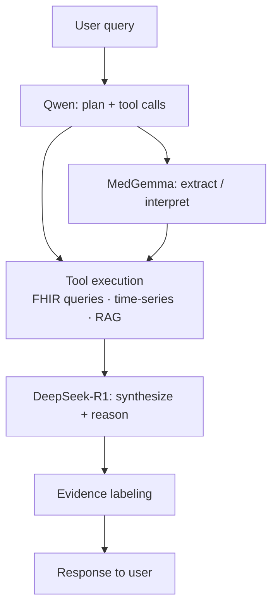

# AI & ML Layer

The AI layer is built around three fixed **roles** (reasoner, tool-caller, medical extractor) with configurable **providers** for each. The defaults run fully locally via Ollama; every role can be independently pointed at a local-network or cloud endpoint instead. See [Model Providers](model-providers.md) for configuration and [AI Transparency](ai-transparency.md) for how each call is disclosed and recorded.

## Model roles

The architecture fixes three **roles**; the specific model and provider for each is
configuration, not architecture. The model landscape moves far faster than this spec, so we do
**not** pin versions here. Instead we define **what each role needs** (durable), and keep the
concrete current picks in a **dated snapshot** below that is expected to churn.

### Selection criteria — the durable part

A model earns a role by scoring against its row below, on the target deployment's hardware and
egress budget. This is the part that does not go stale.

| Role | What it does | Selects on | Hard constraints |
|---|---|---|---|
| **Reasoner** | Synthesis, "what does this mean", evidence-labeled answers, doctor packets | Strongest multi-step reasoning available (reasoning / GPQA / MATH-class benchmarks); long context to hold multi-source health data; reliable instruction-following for evidence labels | Local default must fit target hardware (≈8–14B on a Mac Mini; larger on a dedicated box). The cloud option should be the *current frontier* reasoner. |
| **Tool-caller** | Plans and issues tool calls; the agent backbone | Function-calling reliability (Berkeley Function-Calling-class), native tool use in the chat template, low latency (on every query's hot path); valid structured output matters more than raw intelligence | Small and fast enough to stay responsive — 7B runs on ~8 GB, 14–32B for complex multi-tool workflows. |
| **Medical extractor** | Structured extraction from clinical notes; DICOM/image summaries; lab interpretation | Medical-domain performance (clinical extraction/NER, radiology summarization); vision for imaging | **Runs locally, always** — it sees the least-processed PHI, so it is never a cloud role. |
| **Embeddings** | Vectorizes records + guideline corpus for retrieval | Retrieval quality on clinical/biomedical text (MTEB / biomedical retrieval); dimension vs pgvector index cost | Local-runnable; the dimension is fixed at index-build time — changing it means re-embedding. |

The point of separating roles is that they have different risk and latency profiles: it is what
makes "frontier reasoning over locally-extracted PHI" expressible — a cloud reasoner on top of a
medical extractor that never leaves the machine.

### Current defaults — snapshot (2026-08)

!!! warning "This table is a point-in-time snapshot and will go stale"
    These are the concrete picks as of **2026-08**, chosen against the criteria above from the
    benchmarks available then. They are defaults to re-benchmark, **not commitments** — do not
    treat any version here as load-bearing. The authoritative, versioned IDs live in
    [Model Providers](model-providers.md) config; the re-evaluation cadence is an
    [open question](#open-questions).

| Role | Local default | Cloud option (frontier) |
|---|---|---|
| Reasoner | DeepSeek-R1 distill (8–14B), or a Qwen3 reasoning variant | current frontier reasoner (e.g. Claude Opus 5) |
| Tool-caller | Qwen3 (7–32B) | current frontier tool-use model (e.g. Claude Sonnet 5) |
| Medical extractor | MedGemma | — (local only, by constraint) |
| Embeddings | *unsettled* — nomic-embed-text · mxbai-embed-large · MedGemma embeddings | — |

## Model routing

The agent loop uses Qwen as the default model for tool selection and orchestration. R1 is invoked for:
- Complex reasoning over multi-source data
- Synthesizing a final answer with evidence labeling
- Doctor-packet generation

MedGemma is invoked for:
- Extracting structured data from unstructured clinical text
- Generating DICOM image summaries
- Lab value interpretation in clinical context

## RAG design

### Indexing

On ingestion (and on a scheduled re-index), FHIR resources are chunked, embedded, and stored in pgvector:

- `Observation` resources: embed the display name + value + date + reference range
- `DocumentReference` resources: chunk the content text (clinical notes, PDF extracts) into ~512-token chunks with 64-token overlap
- `DiagnosticReport` resources: embed the conclusion/summary text
- `Condition`, `MedicationStatement`: embed as short descriptive strings

Embedding model: *TBD — see [Storage open questions](storage.md#open-questions)*

### Retrieval

For each user query, the agent:
1. Embeds the query
2. Retrieves top-K chunks from pgvector (cosine similarity)
3. Also retrieves time-series data for relevant LOINC codes over the requested time window
4. Packs retrieved context into the reasoning prompt

### Static guideline corpus

A curated, locally-stored set of clinical guidelines and reference ranges is bundled with ayuOS. This covers:
- Common lab reference ranges (age/sex/unit adjusted)
- Basic interpretation of key biomarkers (lipids, hormones, metabolic panel, CBC)
- Longevity-relevant research summaries (curated, not live PubMed)

This corpus is embedded at startup and included in retrieval. It allows the agent to give grounded answers even before the user has ingested much of their own data.

## Evidence labeling

Every claim in an agent response is tagged with one of:

| Label | Meaning |
|---|---|
| `source-backed` | Directly supported by a specific record in the user's data |
| `guideline-backed` | Supported by the bundled guideline corpus |
| `inferred` | Plausible conclusion from the data, not directly stated |
| `speculative` | Low-confidence inference; the model flags uncertainty |

The agent prompt requires it to produce a citation list mapping each claim to its label and source. The UI renders these inline.

## Cloud providers

Cloud providers are configured at the model-role level, not toggled per query — the roles have different risk profiles, and separating them is what makes "frontier reasoning over locally-extracted PHI" expressible. When a cloud provider is configured for a role, the PII gateway applies automatically and unconditionally before every call to that role. See [Model Providers](model-providers.md) for configuration, [PII Gateway](pii-gateway.md) for stripping detail, and [Tiers & Fallbacks](tiers.md#axis-2-inference) for the trade each tier represents.

The full-local default (all three roles on Ollama) means no health data leaves the machine. Choosing a cloud provider for any role means that role's prompts — PII-stripped — will leave the machine, which the header indicator shows at all times.

Two properties hold regardless of configuration:

- **Every model call is ledgered locally** — cloud and local alike, with the full payload retained and queryable ([AI Transparency](ai-transparency.md)).
- **Cloud is a preference, not a dependency.** An unreachable provider falls back to the role's local model. Losing cloud access costs reasoning depth on hard questions; it removes no workflow.

## Open questions

- [ ] Which embedding model to use locally? (nomic-embed-text, mxbai-embed-large, MedGemma embeddings)
- [ ] What is the optimal chunk size and overlap for clinical notes?
- [ ] Should the guideline corpus be embedded at startup or pre-embedded at build time?
- [ ] Model currency: on what cadence are all three local roles **and** the cloud-alternative IDs re-benchmarked against the current frontier, and what is the upgrade/rollback path when a better model ships?
