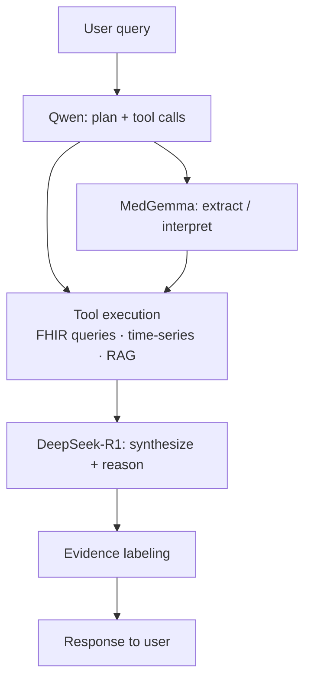

# AI & ML Layer

## Models

Three models run locally via Ollama, each with a distinct role:

| Model | Role | Size | Why |
|---|---|---|---|
| DeepSeek-R1 distill (8–14B) | Reasoner | 8–14B | Strong chain-of-thought reasoning at local-runnable size; handles the "what does this mean" question |
| Qwen (tool-caller variant) | Agent backbone / tool use | ~7B | Reliable function-calling; lighter than R1; handles "what do I need to look up" routing |
| MedGemma | Medical extraction + vision | varies | Purpose-built for medical text and imaging; used for structured extraction from clinical notes and DICOM summaries |

## Model routing

The agent loop uses Qwen as the default model for tool selection and orchestration. R1 is invoked for:
- Complex reasoning over multi-source data
- Synthesizing a final answer with evidence labeling
- Doctor-packet generation

MedGemma is invoked for:
- Extracting structured data from unstructured clinical text
- Generating DICOM image summaries
- Lab value interpretation in clinical context

## RAG design

### Indexing

On ingestion (and on a scheduled re-index), FHIR resources are chunked, embedded, and stored in pgvector:

- `Observation` resources: embed the display name + value + date + reference range
- `DocumentReference` resources: chunk the content text (clinical notes, PDF extracts) into ~512-token chunks with 64-token overlap
- `DiagnosticReport` resources: embed the conclusion/summary text
- `Condition`, `MedicationStatement`: embed as short descriptive strings

Embedding model: *TBD — see [Storage open questions](storage.md#open-questions)*

### Retrieval

For each user query, the agent:
1. Embeds the query
2. Retrieves top-K chunks from pgvector (cosine similarity)
3. Also retrieves time-series data for relevant LOINC codes over the requested time window
4. Packs retrieved context into the reasoning prompt

### Static guideline corpus

A curated, locally-stored set of clinical guidelines and reference ranges is bundled with ayuOS. This covers:
- Common lab reference ranges (age/sex/unit adjusted)
- Basic interpretation of key biomarkers (lipids, hormones, metabolic panel, CBC)
- Longevity-relevant research summaries (curated, not live PubMed)

This corpus is embedded at startup and included in retrieval. It allows the agent to give grounded answers even before the user has ingested much of their own data.

## Evidence labeling

Every claim in an agent response is tagged with one of:

| Label | Meaning |
|---|---|
| `source-backed` | Directly supported by a specific record in the user's data |
| `guideline-backed` | Supported by the bundled guideline corpus |
| `inferred` | Plausible conclusion from the data, not directly stated |
| `speculative` | Low-confidence inference; the model flags uncertainty |

The agent prompt requires it to produce a citation list mapping each claim to its label and source. The UI renders these inline.

## Cloud escalation

When the user opts in to cloud escalation for a specific query:
1. The assembled context (retrieved chunks + query) passes through the [PII gateway](pii-gateway.md)
2. The user previews the stripped payload
3. The stripped payload goes to the configured cloud LLM (Anthropic, OpenAI)
4. The response is returned and logged in the audit trail

Cloud escalation is off by default. It is never automatic.

## Open questions

- [ ] Which embedding model to use locally? (nomic-embed-text, mxbai-embed-large, MedGemma embeddings)
- [ ] What is the optimal chunk size and overlap for clinical notes?
- [ ] Should the guideline corpus be embedded at startup or pre-embedded at build time?
- [ ] How to handle model updates — when a new DeepSeek-R1 version ships, what's the upgrade path?
