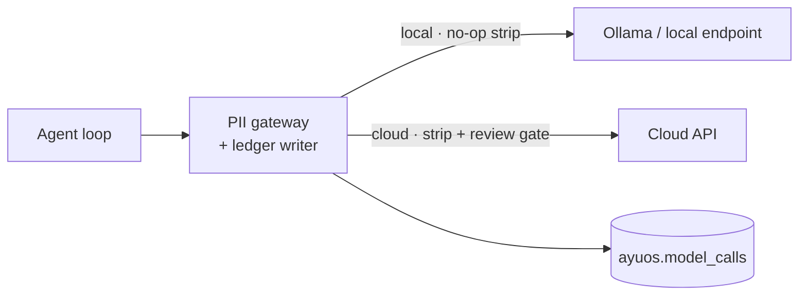

# AI Transparency

Because ayuOS supports [cloud inference tiers](tiers.md#axis-2-inference), "the data stays on
your machine" is no longer a claim the architecture makes for you unconditionally. It is a
claim that depends on how you configured it.

So the guarantee shifts from *nothing leaves* to something the user can actually verify:

!!! abstract "The claim"
    **You can always see which model is being called, where it runs, exactly what was sent,
    and what came back — before the call for anything leaving the device, and after the call
    for everything, forever.**

    This holds in every tier, including ayuOS Cloud. It is not a setting that can be turned
    off; the review gate is configurable, the record is not.

This page specifies the disclosure surface. [Model Providers](model-providers.md) covers
configuration; [PII Gateway](pii-gateway.md) covers what gets stripped.

---

## Three disclosure surfaces

| Surface | When | Answers |
|---|---|---|
| **Status indicator** | Always visible | *Right now, which roles are local and which are cloud?* |
| **Pre-send review** | Before a call leaves the device | *Exactly what is about to be sent, and what was redacted?* |
| **Call ledger** | After every call, retained locally | *What has ever been sent, to whom, containing what?* |

---

## 1. Status indicator

The chat header shows the current posture at all times, without the user opening a settings
page:

```
 ◍ reasoner  claude-opus-4-8 · anthropic · cloud       ← amber
 ● tools     qwen2.5:7b · ollama · local               ← green
 ● medical   medgemma:4b · ollama · local              ← green
```

Rules:

- **Green means no health data leaves the device for that role.** Local and local-network
  providers are green; local-network shows the endpoint host on hover.
- **Amber means that role's prompts leave the device**, PII-stripped. Amber is never silent —
  a fully-local install shows three greens and a user who changes that sees the change.
- The indicator reflects **resolved runtime state**, not the config file. If a cloud provider
  is configured but unreachable and the call fell back to local, it shows what actually ran.
- Clicking any role opens that role's slice of the [call ledger](#3-call-ledger).

---

## 2. Pre-send review

Before any payload leaves the device, the user can see it in full. What varies by
configuration is *how often they are asked*, not whether they can look.

### Review modes

Set per role in `config.toml`. This is the setting that reconciles a one-off escalation
(where confirming every send is right) with a standing cloud reasoner (where it is unusable).

| Mode | Behaviour | When it fits |
|---|---|---|
| `every_call` | Full preview + explicit confirmation before every send. **Default** whenever a cloud provider is first configured for a role. | Occasional escalation on hard questions |
| `new_shape` | Confirm once per distinct *payload shape* — a new resource type, a new tool's output, or a new redaction category appearing in the payload. Subsequent structurally-identical sends proceed. | A standing cloud reasoner, retaining meaningful review |
| `off` | Standing consent. No prompt. The ledger still records every call in full. | Power users who audit after the fact |

Two constraints on the modes, both enforced in code:

- **`off` cannot be set before the user has seen at least one full preview for that role.**
  You cannot consent to a payload shape you have never looked at.
- **No mode suppresses the ledger.** `off` removes the prompt, never the record.

### What the preview shows

1. **The exact payload**, verbatim, as it will be transmitted — system prompt, retrieved
   context, tool outputs, and user query.
2. **A redaction diff** — every substitution the gateway made, in place:
   `Dr. Sarah Chen` → `[PROVIDER_NAME]`, `2026-03-14` → `2025-11-17 (shifted −117d)`.
3. **The destination** — provider, model, API hostname.
4. **What was withheld entirely** — hard exclusions that were dropped rather than masked, and
   why. If genomic context was relevant to the query and excluded (its default), the user is told,
   because otherwise the answer's limits are invisible — along with the option to opt in and send
   it, with an identifiability warning.
5. **Token count and estimated cost**, where the provider publishes pricing.

---

## 3. Call ledger

Every model invocation is appended to `ayuos.model_calls` — **local, whether the call was
local or cloud**. Local calls are recorded too; a transparency log that only records the scary
calls cannot answer "what did the agent actually do to produce this answer?"

```json
{
  "call_id": "01J8F2K…",
  "timestamp": "2026-08-03T10:23:00Z",
  "role": "reasoner",
  "trigger": { "kind": "user_query", "query_id": "01J8F2H…" },

  "provider": "anthropic",
  "model": "claude-opus-4-8",
  "destination": "api.anthropic.com",
  "left_device": true,

  "gateway": {
    "applied": true,
    "redactions": { "PERSON": 4, "FACILITY": 2, "MRN": 1, "ADDRESS": 1 },
    "date_shift_days": -117,
    "hard_exclusions": ["MolecularSequence"]
  },

  "payload": {
    "retained": true,
    "sha256": "…",
    "token_count": 2847
  },
  "response": { "retained": true, "token_count": 512 },

  "review": { "mode": "new_shape", "prompted": true, "user_confirmed": true },
  "tools_invoked": ["query_observations", "search_guidelines"],
  "cost_usd": 0.043
}
```

### Payloads are retained, not hashed

An earlier revision of this spec stored only a payload hash. That was the wrong call: the
ledger lives on the user's own machine, alongside the health data itself, so hashing protects
nothing and destroys the ability to answer the one question that matters — *what exactly did
you send?*

**The full request and response are retained by default**, subject to a user-set retention
window (default: indefinite). The hash remains in the record so a user can prove a given
payload is the one that was sent, and so retention pruning leaves a verifiable stub behind.

### The ledger is queryable, not just viewable

It is a Postgres table in the `ayuos` schema, so the obvious questions are answerable
directly, and the agent exposes them as a tool:

- *Has anything ever gone to OpenAI?* — `where provider = 'openai'`
- *What left the device last month, and what did it cost?*
- *Which calls contained data derived from my Fasten-sourced records?*
- *Show me every payload where the gateway found zero PII* — the interesting case, since it
  usually means the redactor under-detected rather than that the payload was clean.

### Append-only

The ledger is append-only and is never transmitted anywhere. In the cloud tier it is stored
in the user's own tenant and is exported with their data.

---

## Where enforcement lives

The transparency claim is only as good as the code path that makes it unavoidable. There is a
**single egress chokepoint**: no model provider client may open a socket directly. Every call
— local or cloud — is constructed by the gateway, which is what writes the ledger entry and,
for off-device destinations, applies stripping and gates on the review mode.



Consequences of the chokepoint being the only path:

- A provider client that bypasses the gateway cannot reach the network — it has no transport.
- A bug that skips stripping is a *loud* failure: the ledger entry exists with
  `gateway.applied: false`, which is a startup-blocking invariant violation, not a silent leak.
- Adding a provider means implementing a request builder, never a network client.

See [Architecture — trust boundary](architecture.md#2-pii-gateway-trust-boundary).

---

## Verifying it yourself

The point of an auditable system is that you do not have to take this page's word for it. All
four of these are things a self-hosting user can do without our cooperation:

| Check | How |
|---|---|
| **Nothing leaves in the full-local config** | Configure all three roles local, then pull the network cable or block the process at the firewall. Every workflow still completes. |
| **The ledger matches reality** | Run Little Snitch, `tcpdump`, or a proxy alongside ayuOS. Every outbound connection should have a corresponding ledger row; there should be no row without a connection and no connection without a row. |
| **Stripping does what it says** | The pre-send preview is the payload. Compare it against the source record in the timeline view. |
| **The code does what this page says** | The source is public and MIT-licensed. The chokepoint is one module. |

Cloud-tier users can do the first three against their own tenant's ledger, but not the
fourth against the running instance — which is the honest difference between the tiers, stated
again where it matters.

---

## Open questions

- [ ] Should `new_shape` be the default rather than `every_call` once a user has confirmed N
      calls for a role? Auto-relaxing consent is convenient and slightly dishonest.
- [ ] Payload retention default: indefinite is best for transparency and worst for disk. Is a
      size-based cap (prune oldest beyond X GB) better than a time-based one?
- [ ] Does the ledger need a tamper-evident chain (each row hashing its predecessor), or is
      append-only in Postgres sufficient for the local threat model?
- [ ] Should the agent proactively cite its own ledger — "this answer used a cloud reasoner" —
      inline in responses, alongside [evidence labels](ai-ml.md#evidence-labeling)?
- [ ] How is the ledger surfaced for the local-network tier, where "left the device" is true
      but "left the network" is false? Green with a caveat, or a third colour?
