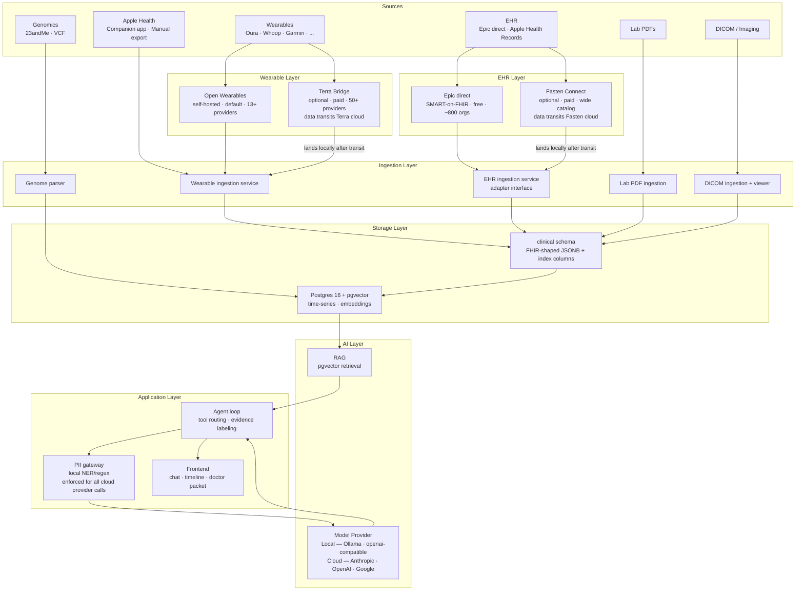

# Architecture Overview

## System map

## Process boundaries

The architecture enforces three isolation boundaries:

### 1. EHR adapter boundary (vendor-independence boundary)

EHR sources sit behind a single ingestion interface. Epic direct, the Apple Health export
parser, and Fasten Connect are **adapters** behind it — no external service is ever the
interface itself. This is a deliberate response to Fasten Onprem being archived mid-project;
see [ADR-0001](adr/0001-ehr-ingestion.md).

!!! note "The GPL boundary is gone"
    Earlier revisions isolated a GPL-3.0 Fasten fork in its own process so it could not be
    linked into the core. **ayuOS no longer forks Fasten**, so there is no GPL code in the
    process map and no license boundary to maintain.

### 2. PII gateway (trust boundary)

All model calls — whether to a local Ollama instance or to a cloud API — pass through the PII gateway. For local providers, the gateway is a no-op passthrough. For cloud providers, stripping is applied unconditionally before the prompt leaves the machine. There is no way to send data to a cloud model without it passing through the gateway first.

### 3. Data residency boundary (Terra Bridge · Fasten Connect)

Two optional paid add-ons route data through a third party before it lands locally:
**Terra Bridge** for gated wearable providers, and **Fasten Connect** for EHR breadth beyond
Epic. Both must be enabled **per provider with explicit user consent**, and neither is ever on
by default. Everything else in the system is zero-egress.

## Data flow

1. **Ingestion** — sources push/pull into the ingestion layer on a schedule or on-demand. Adapters write FHIR resources into the `clinical` schema and device metrics into `timeseries`, each carrying a content hash and source provenance so re-runs are idempotent.
2. **Normalization** — clinical resources are stored as received, with index columns extracted via `@medplum/core`. A crosswalk layer handles LOINC/SNOMED/RxNorm deduplication across sources.
3. **Embedding** — Relevant FHIR resources and time-series observations are embedded and stored in pgvector for retrieval.
4. **Query** — User asks a question. The agent loop retrieves relevant context via RAG, routes sub-tasks to the appropriate model (R1 for reasoning, Qwen for tool use, MedGemma for medical extraction), assembles a response with evidence labels, and returns it to the frontend.
5. **Escalation (opt-in)** — For hard questions, the user can toggle cloud escalation. The PII gateway strips the payload; the user previews and confirms; the stripped context goes to a cloud LLM; the response is logged in the audit trail.

## Technology choices

| Layer | Technology | Rationale |
|---|---|---|
| Clinical store | ayuOS-owned Postgres schemas | FHIR at the boundaries, SQL inside — [ADR-0002](adr/0002-clinical-data-store.md) |
| FHIR toolkit | `@medplum/core` + `@medplum/definitions` (library) | Apache-2.0, zero deps, no server — FHIRPath, SearchParameter registry, index extraction, validation |
| EHR — base | Apple Health export parser | Raw provider FHIR JSON; no entitlement, no registration, zero egress |
| EHR — direct | Epic SMART-on-FHIR | Free, auto-distributed to ~800 orgs, includes clinical notes |
| EHR — premium (optional) | Fasten Connect (paid) | Breadth beyond Epic; data transits Fasten, 24h retention |
| Time-series + vectors | Postgres 16 + pgvector | One database, no extra infra |
| Wearable ingestion | Open Wearables (self-hosted) | 13+ providers, zero data transit, open source |
| Wearable bridge (optional) | Terra Bridge (paid) | 50+ providers for gated devices; data transits Terra |
| Model runtime (default) | Ollama | Simplest local model runtime; Apple Silicon optimized |
| Model runtime (advanced) | Any OpenAI-compatible endpoint | LM Studio, vLLM, network inference box |
| Cloud model providers (optional) | Anthropic, OpenAI, Google | Configurable per role; PII gateway always enforced |
| Reasoner (default) | DeepSeek-R1 distill (8–14B) | Strong reasoning at local-runnable size |
| Tool-caller (default) | Qwen | Reliable function-calling at smaller size |
| Medical extraction (default) | MedGemma | Purpose-built for medical text + vision; open weights |

## What is NOT in scope (yet)

- Live EHR sync via direct Epic/Cerner registration (Apple Health export covers most institutions for MVP; see [External Dependencies](external-deps.md))
- Apple HealthKit live sync without the companion app (manual export is MVP; companion app is P1)
- Multi-user / household support
