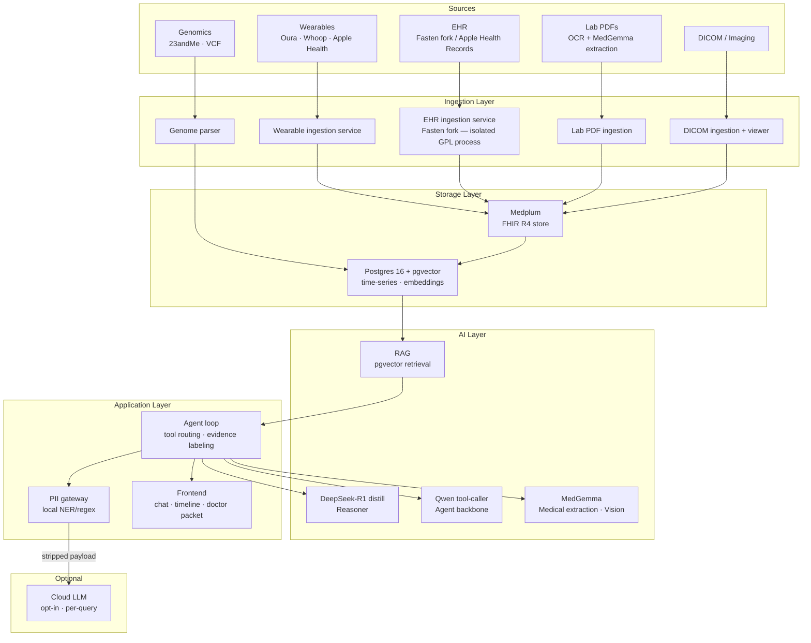

# Architecture Overview

## System map

## Process boundaries

The architecture enforces two critical isolation boundaries:

### 1. Fasten fork isolation (license boundary)

Fasten Health is GPL-3.0. The ayuOS core is Apache-2.0. These cannot share a process.

The Fasten fork runs as an independent Go service behind a well-defined REST/FHIR API. The Apache-2.0 core calls it over localhost. No GPL code is compiled into the core.

### 2. PII gateway (trust boundary)

Before any data leaves the machine — even for an opt-in cloud escalation — it passes through the local PII stripping gateway. The gateway applies NER + regex to remove or mask names, dates of birth, addresses, provider names, and other identifying fields. The user sees the stripped payload before it is sent and must confirm.

## Data flow

1. **Ingestion** — sources push/pull into the ingestion layer on a schedule or on-demand. All connectors write normalized FHIR resources to Medplum.
2. **Normalization** — Medplum stores canonical FHIR R4 resources. A crosswalk layer handles LOINC/SNOMED/RxNorm deduplication across sources.
3. **Embedding** — Relevant FHIR resources and time-series observations are embedded and stored in pgvector for retrieval.
4. **Query** — User asks a question. The agent loop retrieves relevant context via RAG, routes sub-tasks to the appropriate model (R1 for reasoning, Qwen for tool use, MedGemma for medical extraction), assembles a response with evidence labels, and returns it to the frontend.
5. **Escalation (opt-in)** — For hard questions, the user can toggle cloud escalation. The PII gateway strips the payload; the user previews and confirms; the stripped context goes to a cloud LLM; the response is logged in the audit trail.

## Technology choices

| Layer | Technology | Rationale |
|---|---|---|
| EHR backbone | Medplum (TypeScript) | FHIR R4 native, self-hosted, Apache-2.0, active community |
| EHR connectors | Fasten fork (Go) | SMART-on-FHIR clients for hundreds of providers; no point rebuilding |
| Time-series + vectors | Postgres 16 + pgvector | One database, no extra infra |
| Local inference | Ollama | Simplest local model runtime; Apple Silicon optimized |
| Reasoner | DeepSeek-R1 distill (8–14B) | Strong reasoning at local-runnable size |
| Tool-caller | Qwen | Reliable function-calling at smaller size |
| Medical extraction | MedGemma | Purpose-built for medical text + vision; open weights |

## What is NOT in scope (yet)

- Live EHR sync via direct Epic/Cerner registration (Apple Health export covers most institutions for MVP; see [External Dependencies](external-deps.md))
- Apple HealthKit live sync (requires Apple Developer Program; manual export used for MVP)
- Multi-user / household support
- Mobile app
- Any cloud-hosted version of ayuOS
