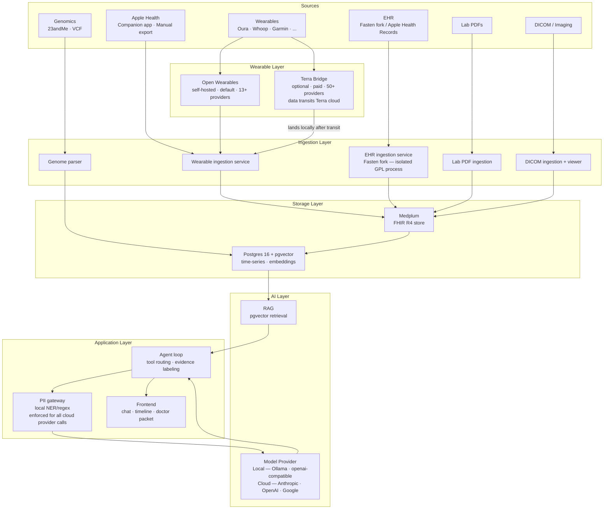

# Architecture Overview

## System map

## Process boundaries

The architecture enforces three isolation boundaries:

### 1. Fasten fork isolation (license boundary)

Fasten Health is GPL-3.0. The ayuOS core is Apache-2.0. These cannot share a process.

The Fasten fork runs as an independent Go service behind a well-defined REST/FHIR API. The Apache-2.0 core calls it over localhost. No GPL code is compiled into the core.

### 2. PII gateway (trust boundary)

All model calls — whether to a local Ollama instance or to a cloud API — pass through the PII gateway. For local providers, the gateway is a no-op passthrough. For cloud providers, stripping is applied unconditionally before the prompt leaves the machine. There is no way to send data to a cloud model without it passing through the gateway first.

### 3. Terra Bridge (data residency boundary)

Terra Bridge is an optional paid add-on. When enabled for a specific provider, that provider's data transits Terra's cloud before landing in the local Open Wearables instance. The boundary is explicit: Terra Bridge must be enabled per provider with user consent; it is never on by default.

## Data flow

1. **Ingestion** — sources push/pull into the ingestion layer on a schedule or on-demand. All connectors write normalized FHIR resources to Medplum.
2. **Normalization** — Medplum stores canonical FHIR R4 resources. A crosswalk layer handles LOINC/SNOMED/RxNorm deduplication across sources.
3. **Embedding** — Relevant FHIR resources and time-series observations are embedded and stored in pgvector for retrieval.
4. **Query** — User asks a question. The agent loop retrieves relevant context via RAG, routes sub-tasks to the appropriate model (R1 for reasoning, Qwen for tool use, MedGemma for medical extraction), assembles a response with evidence labels, and returns it to the frontend.
5. **Escalation (opt-in)** — For hard questions, the user can toggle cloud escalation. The PII gateway strips the payload; the user previews and confirms; the stripped context goes to a cloud LLM; the response is logged in the audit trail.

## Technology choices

| Layer | Technology | Rationale |
|---|---|---|
| EHR backbone | Medplum (TypeScript) | FHIR R4 native, self-hosted, Apache-2.0, active community |
| EHR connectors | Fasten fork (Go) | SMART-on-FHIR clients for hundreds of providers; no point rebuilding |
| Time-series + vectors | Postgres 16 + pgvector | One database, no extra infra |
| Wearable ingestion | Open Wearables (self-hosted) | 13+ providers, zero data transit, open source |
| Wearable bridge (optional) | Terra Bridge (paid) | 50+ providers for gated devices; data transits Terra |
| Model runtime (default) | Ollama | Simplest local model runtime; Apple Silicon optimized |
| Model runtime (advanced) | Any OpenAI-compatible endpoint | LM Studio, vLLM, network inference box |
| Cloud model providers (optional) | Anthropic, OpenAI, Google | Configurable per role; PII gateway always enforced |
| Reasoner (default) | DeepSeek-R1 distill (8–14B) | Strong reasoning at local-runnable size |
| Tool-caller (default) | Qwen | Reliable function-calling at smaller size |
| Medical extraction (default) | MedGemma | Purpose-built for medical text + vision; open weights |

## What is NOT in scope (yet)

- Live EHR sync via direct Epic/Cerner registration (Apple Health export covers most institutions for MVP; see [External Dependencies](external-deps.md))
- Apple HealthKit live sync without the companion app (manual export is MVP; companion app is P1)
- Multi-user / household support
