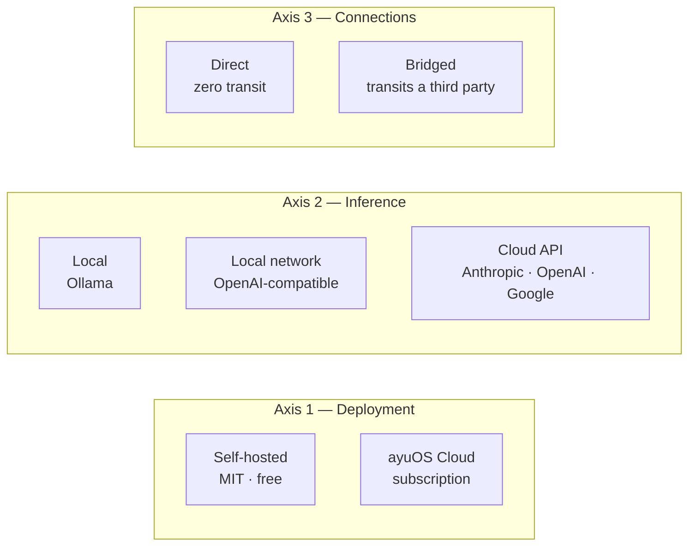

# Tiers & Fallbacks

ayuOS is not one deployment with one privacy story. It is a core plus a set of choices the
user makes independently — where the software runs, where the models run, and how each data
source connects. This page explains why those choices are tiered, what each tier costs, and
what happens when a tier becomes unavailable.

!!! abstract "The short version"
    **Every tier has a free, zero-transit path that works on its own.** Paid and hosted tiers
    buy breadth, capability, or convenience on top of that path — they never replace it. When
    a paid tier disappears, you lose the breadth, not the system.

---

## Why tiers exist

The obvious design would be a single configuration: everything local, everything free,
nothing leaves the machine. We do not ship that as the only option, because it fails real
users in three specific ways.

| Forcing full local means | The consequence |
|---|---|
| The user provides the hardware | A Mac Mini with 32 GB RAM is a real barrier. Someone who wants to understand their own labs should not need to buy a computer first. |
| Local models may not be strong enough | On the hardest synthesis questions — the ones users care most about — today's local models can be measurably weaker than a frontier model, and pretending otherwise isn't sovereignty, it's a worse answer. The tiers answer this two ways: point the reasoner at a frontier API now, and in time at ayuOS's own specialised health models, which aim to outperform a generic frontier LLM on exactly these questions. |
| Some data is simply unreachable | Garmin and Dexcom require formal developer agreements. Non-Epic health systems require a connector catalogue we have chosen not to maintain today — a current tradeoff, not a permanent stance. No amount of local compute reaches them. |

And the inverse design — a single managed cloud product — fails differently: it asks the user
to replace a verifiable architectural guarantee with a promise, which is exactly the trade
[every existing competitor](vision.md#the-problem) already offers.

**So the tiers exist to let the user place each decision separately, and to make the cost of
each decision legible before they make it.** A user can run local models against
cloud-bridged EHR data, or a frontier reasoner against strictly local wearable data. Those
are different risk postures and both are legitimate. The system's job is not to pick one; it
is to make sure the user knows which one they are in at all times — see
[AI Transparency](ai-transparency.md).

---

## The three axes

Tiering happens on three independent axes. They are frequently confused, so they are named
separately here and everywhere else in this spec.

| | Axis 1 — **Deployment** | Axis 2 — **Inference** | Axis 3 — **Connections** |
|---|---|---|---|
| **Question it answers** | Where does ayuOS run? | Where do the models run? | How does data reach the store? |
| **Free default** | Self-hosted | Local (Ollama) | Direct — Apple Health export, Epic, Open Wearables |
| **Paid / hosted option** | ayuOS Cloud | Cloud API | Bridged — Fasten Connect, Terra Bridge |
| **What the option buys** | No ops work, no hardware | Stronger reasoning | Providers the direct path cannot reach |
| **What it costs** | Data lives on operated infrastructure | PII-stripped context leaves the machine | Records transit a vendor before landing locally |
| **Detail** | [Deployment](deployment.md) | [Model Providers](model-providers.md) | [ADR-0001](adr/0001-ehr-ingestion.md) · [Open Wearables](open-wearables.md) |

The axes are genuinely independent. Choosing ayuOS Cloud does not force cloud models;
choosing a cloud reasoner does not force bridged connectors.

---

## Axis 1 — Deployment

### Self-hosted (MIT, free forever)

The full system on the user's own hardware. In the default configuration, with local
inference and direct connectors, ayuOS makes no outbound call carrying health data — not
because a setting forbids it, but because no such call exists in the code path. The source is
auditable and the guarantee is verifiable; see [Security & Privacy](security.md).

This tier is free in perpetuity and is never feature-gated against the cloud tier. Anything
the cloud tier can compute, a sufficiently equipped self-hosted install can compute.

### ayuOS Cloud (managed subscription)

The same core, operated for the user. This is for people who want the capability without
running Postgres, pulling model weights, or debugging a Whoop OAuth refresh. Data lives on
ayuOS-operated infrastructure under published commitments: never sold, never used for model
training, never shared with third parties.

This is a weaker claim than the self-hosted tier's, and the spec says so plainly rather than
blurring the two. It is a *policy* guarantee backed by an operator, not an *architectural*
guarantee backed by the absence of a network path. It is still substantially stronger than
the alternatives, because the revenue is a subscription and therefore does not point at the
data — but it is not the same claim, and users should choose it knowing that.

The subscription is what funds maintenance of the open-source core. See
[Governance](governance.md#sustainability).

---

## Axis 2 — Inference

Model **roles** are fixed (reasoner, tool-caller, medical extractor); model **providers** are
configured per role. This is the axis with the finest granularity, and deliberately so — it
lets a user put frontier reasoning on top of strictly local PHI handling.

| Tier | Egress | Typical use |
|---|---|---|
| **Local — Ollama** (default) | None | Everything, offline, on the user's hardware |
| **Local network** — any OpenAI-compatible endpoint | None beyond the LAN | A dedicated inference box running a 70B model |
| **Cloud API** — Anthropic, OpenAI, Google | PII-stripped context only | The synthesis step, where model quality matters most |

The recommended hybrid keeps **MedGemma local** — it is the role that sees raw clinical text —
and puts only the reasoner on a cloud API, where it receives context that has already passed
the [PII gateway](pii-gateway.md). Full configuration detail is in
[Model Providers](model-providers.md).

Whatever the configuration, every model call is disclosed and recorded. That is the subject
of its own page: [AI Transparency](ai-transparency.md).

---

## Axis 3 — Connections

Each data source is reachable either **directly** (the data goes from the source to the user's
store, with no intermediary holding it) or via a **bridge** (a vendor retrieves it and the
user's install pulls it down afterward).

| Source | Direct path | Bridged path | Why a bridge exists |
|---|---|---|---|
| **Wearables** | [Open Wearables](open-wearables.md), self-hosted, 13+ providers | Terra Bridge (paid) — 50+ providers | Garmin, Dexcom and similar require a formal developer agreement that an individual cannot obtain |
| **EHR** | Apple Health export (~450 systems) · Epic SMART-on-FHIR (~800 orgs) | Fasten Connect (paid) | Cerner, Meditech, athenahealth, eClinicalWorks and payers are unreachable without a connector catalogue we have chosen not to own |
| **Labs · imaging · genomics** | Local file parse | — | No bridge needed; the user already holds the files |

Bridged tiers are **opt-in per provider**, never on by default, and the consent prompt states
explicitly that records transit the vendor's infrastructure. See
[ADR-0001](adr/0001-ehr-ingestion.md#consent-requirement).

!!! note "The tiers are complementary, not redundant"
    No single path covers a typical user's providers. Someone with a Garmin, an Epic hospital,
    and a Cerner specialist needs three tiers. This is an honest limitation of the US health
    data landscape, not a gap in the design.

---

## The fallback guarantee

This is the load-bearing property of the whole scheme, and it is not hypothetical: **the
project's original EHR spine, Fasten Onprem, was archived mid-2026 and stopped retrieving
records.** The tiering exists partly because that has already happened once.

**The invariant: no tier is a dependency of the tier below it.** Every paid or hosted tier
degrades to a free, zero-transit path that continues to work.

| If this becomes unavailable | You fall back to | What you actually lose |
|---|---|---|
| **ayuOS Cloud** shuts down or you cancel | Self-hosted, same open-source code, full data export | The managed hosting. Not the software, not the data, not any feature. |
| **A cloud model API** — key expires, provider outage, you go offline | Local models via Ollama | Reasoning depth on the hardest questions. Every workflow still completes. |
| **Fasten Connect** — pricing changes, service ends | Apple Health export + Epic direct | New records from non-Epic providers. Everything already ingested stays in your Postgres. |
| **Terra Bridge** — same | Open Wearables, 13+ providers direct | New data from gated devices only. |
| **Open Wearables** upstream stalls | Direct provider APIs behind the same adapter interface | Maintenance leverage — we would own more connector code. |
| **A single provider API breaks** | Every other connector | That one source. Connectors [fail loudly and degrade gracefully](ingestion/index.md#design-principles); the agent still answers over what is stored. |

Three architectural properties make this real rather than aspirational:

1. **Adapters, never interfaces.** No external service is ever the interface itself. Epic,
   the Apple Health parser, and Fasten Connect are three implementations behind one ingestion
   interface — this is the direct lesson of the Fasten archival ([ADR-0001](adr/0001-ehr-ingestion.md)).
2. **We own the store.** Ingested data lands in Postgres schemas we designed
   ([ADR-0002](adr/0002-clinical-data-store.md)). It does not live in a vendor's system, so
   losing a vendor never loses history — only future retrieval.
3. **The open core is the whole core.** The cloud tier runs the same MIT-licensed code. There is
   no proprietary component that self-hosters are missing, so "fall back to self-hosted" is a
   migration, not a rebuild.

---

## What every tier shares

These hold in all configurations, paid and free, self-hosted and cloud. They are the floor,
not the differentiator:

- **Data is never sold, and never used to train models.** Any tier, any add-on.
- **Every model call is logged with its provider, destination, and exact payload** — locally
  inspectable, always. See [AI Transparency](ai-transparency.md).
- **The PII gateway is unbypassable on any call leaving the device.** It is enforced in the
  code path, not by a setting.
- **Genomic data, imaging pixel data, and raw source documents never go to a cloud model** —
  hard exclusion, regardless of tier or user setting ([PII Gateway](pii-gateway.md#hard-exclusions)).
- **Full export, at any time, in open formats.** No tier can strand your data.
- **The same MIT-licensed core.** No feature is cloud-exclusive as a lock-in mechanism.

---

## Worked configurations

| Configuration | Deployment | Inference | Connections | Egress posture |
|---|---|---|---|---|
| **Sovereign** | Self-hosted | All local | Direct only | Zero. No outbound call carries health data. |
| **Hybrid reasoning** (recommended default for most) | Self-hosted | MedGemma + tool-caller local; reasoner on a cloud API | Direct only | PII-stripped synthesis context only |
| **Broad coverage** | Self-hosted | All local | Direct + Fasten Connect for a Cerner specialist | Records transit Fasten (24h retention), consented per provider |
| **Managed** | ayuOS Cloud | Cloud | Direct + bridged as needed | Data on operated infrastructure under subscription commitments |

A user can move between these at any time; the choices are configuration, not installation.

---

## Open questions

- [ ] Does ayuOS Cloud offer a bring-your-own-model-key option, so a managed user can still
      direct inference at a provider they hold the contract with?
- [ ] Should the UI compute and display a plain-language "egress posture" summary from the
      current configuration, rather than making the user assemble it from three settings pages?
- [ ] Migration tooling: is cloud → self-hosted a supported one-command export/import, or
      documented manual steps? The fallback guarantee is only credible if it is easy.
- [ ] Is there a middle deployment tier — ayuOS-operated storage with user-held keys — or does
      that complexity buy less than it costs to explain?
